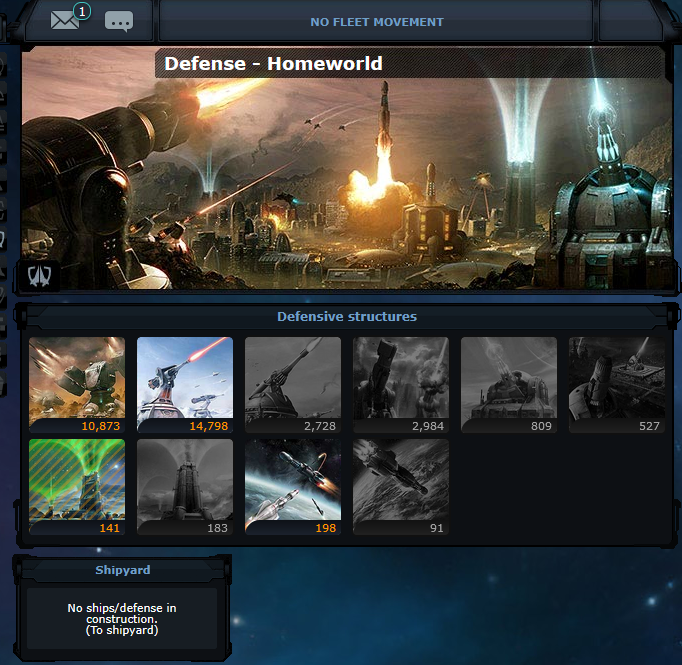

OGameX Event-Driven Framework

A modular setup that automates two tasks for an OGame-style application:

    Account Creation – Automatically generate accounts using Selenium (headless Firefox).

    Planet Seeding – Randomly assign fleets, resources, buildings, defenses, and technologies to each new account’s first planet.

Overview

    Producer (ogame-account-creator):

        Launches up to 4 parallel headless Firefox instances.

        Generates a random email + fixed password (ogame2025).

        Publishes { email, password } to the Kafka topic accounts.

    Consumer (accounts-import-service):

        Starts Zookeeper, Kafka Broker, and Kafka-UI via Docker Compose.

        Consumes { email, password } messages from accounts.

        Appends each account to created_accounts.json.

        Executes SQL updates on MariaDB to populate the new planet (resources, fleets, defenses, buildings, techs).

    Kafka-UI:

        Access at http://localhost:8086 for real-time topic and consumer monitoring.

Data Flow

ogame-account-creator
       │
       ▼
   Kafka (accounts)
       │
       ▼
accounts-import-service → MariaDB (planet seeding)

    Producer creates accounts → publishes to Kafka.

    Consumer reads from Kafka → writes to JSON → updates database.

Kafka’s buffering allows you to generate thousands of accounts at once (e.g., morning) and seed planets later (e.g., afternoon) without overloading the DB.

Why Use This Framework?

    Fully Automated: No manual steps for account registration or planet seeding.

    Event-Driven: Producer and consumer are decoupled via Kafka.

    Scalable & Resilient: Add more producer/consumer instances; Kafka retains unprocessed messages if consumers fail.

    Self-Contained (Docker): No manual installation of Kafka, Zookeeper, or Java dependencies—all run in containers.

    Easy Monitoring: Kafka-UI provides a GUI for inspecting topics and consumer groups.

Prerequisites

    Java 17 + Maven (or use the included Maven Wrapper).

    Docker & Docker Compose (to run Kafka and Zookeeper).

    MariaDB accessible at:

    jdbc:mysql://localhost:3306/laravel?user=root&password=toor

    (Adjust in application.properties if needed.)

    geckodriver.exe Included in the project root

Quick Setup

    Clone the repository

git clone https://github.com/dep1engenharia/accounts-import-service-ms.git
cd accounts-import-service-ms

git clone https://github.com/dep1engenharia/ogamex-accounts-creator-ms.git
cd ogamex-accounts-creator-ms

(Optional) OGameX Production
If you plan to run this framework against the OGameX production-style setup, you must temporarily specify the MariaDB’s container ports. For example, in your Docker Compose file, define the ogamex-db service as follows:

# MariaDB Service (for OGameX prod compatibility)
ogamex-db:
  image: mariadb:11.3.2-jammy
  container_name: ogamex-db
  restart: unless-stopped
  tty: true
  volumes:
    - ogame-dbdata:/var/lib/mysql
    - ./mysql/my.cnf:/etc/mysql/my.cnf
  ports:
    - "13306:3306"        # Map host port 13306 → container port 3306
  environment:
    MYSQL_DATABASE: laravel
    MYSQL_ROOT_PASSWORD: toor
    SERVICE_TAGS: dev
    SERVICE_NAME: mysql
  networks:
    app-network:
      aliases:
        - ogame-db

Then point application.properties to jdbc:mysql://localhost:13306/laravel.

Start all services

Use this curl or on your terminal and start creating accounts.

cURL Example

To trigger account generation via a REST endpoint (if exposed by the producer), use:

curl --location \
     --request POST 'http://localhost:8081/accounts/generate?count=500&ip=192.168.1.21'

    count=500: Number of accounts to generate.

    ip=192.168.1.21: The IP address of the machine where Ogamex is running

These micro-services are independent of the OgameX tech Stack.

Screenshots
CREATING ACCOUNTS VIA POSTMAN

MS ogame-account-creator RECEIVES POSTMAN REQUEST, CREATES THE ACCOUNTS AND SENDS THEM TO THE KAFKA TOPIC

MS accounts-import-service OBTAINS THE ACCOUNTS FROM THE KAFKA TOPIC AND ENRICH THE PLANETS THEM WITH ALL TYPE OF RESOURCES

THE DATA FROM ALL ACCOUNTS IS SAVED FOR LATER AUTOMATIONS, LIKE SPY AND ATTACK REAL USERS.

BEST PART

MILITARY

PLANET DETAILS

Special thanks to @lanedirt for creating such a great project!

License

This project is licensed under the MIT License. Participants are free to use, modify, and distribute as needed.
